### 选择器优先级
 - 通配符 < 标签 < 类 < id < 行内 < !important
 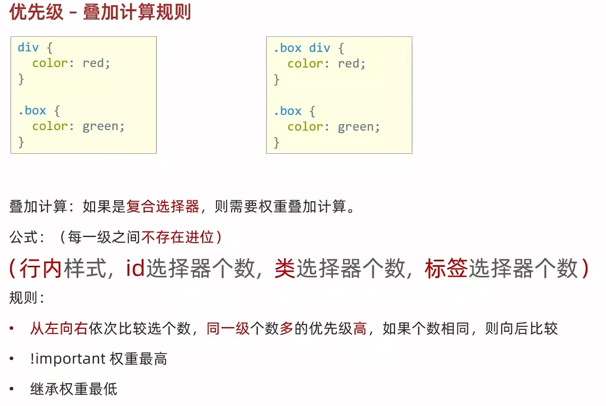
 
### 复合选择器
 - 后代选择器
   -  ```父选择器 子选择器 { CSS属性 }```
   - 父子选择器之间用空格隔开
   - 会选中所有后代标签
 - 子代选择器                                                                                                                                                                                                                                                                                                                      
   - ```父选择器 > 子选择器 { CSS属性 }```
 - 并集选择器
   - ```选择器1,选择器2,选择器3...```
 - 交集选择器
   - ```选择器1选择器2 {CSS属性}```
   - 选择器连写，不用隔开
   - 选中同时满足多个条件的元素
 - 伪类选择器
   - ```选择器:hover {CSS属性}```
 - 伪类选择器（超链接状态）
   1. `:link`     访问前
   2. `:visited`  访问后
   3. `:hover`    鼠标悬停
   4. `:active`   点击时
 - 结构伪类选择器
   - `E:first-child`  查找第一个E元素
   - `E:last-child`   查找最后一个E元素
   - `E:nth-child(N)` 查找第N个E元素（第一个元素N值为1）
   - `E:nth-child(公式)` 
   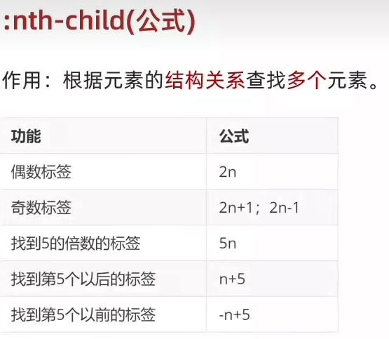
 - 伪元素选择器
   - `E::before` 在E元素里面最`前面`添加一个伪元素 
   - `E::after`  在E元素里面最`后面`添加一个伪元素
   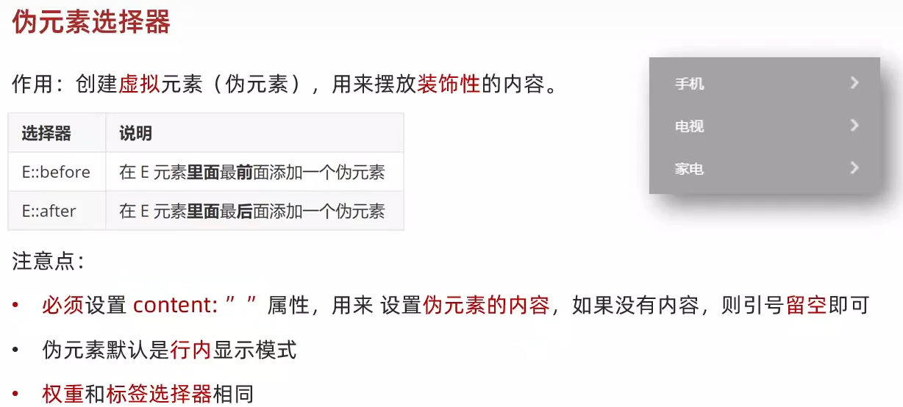

### 背景属性
 - 背景色`background-color`
 - 背景图`background-image`
 - 背景图平铺方式`background-repeat`
   - `no-repeat` 不平铺
   - `repeat`    平铺
   - `repeat-x`  水平方向平铺
   - `repeat-y`  垂直方向平铺
 - 背景图位置`background-position`
   - `left`   左侧
   - `right ` 右侧
   - `center` 居中
   - `top`    顶部
   - `bottom` 底部
 - 背景图缩放`background-size`
   - `cover`   完全缩放
   - `contain` 根据背景区域缩放
   - 百分比、数字+单位
 - 背景图固定`background-attachment`
   - `fixed`  固定定位
 - 背景复合属性`background`
   - 背景色 背景图 背景图平铺方式 背景图位置/背景图缩放

### 标签显示模式
 - 块级元素
   - 独占一行
   - 宽度默认是父级的100%
   - 添加宽高元素生效
 - 行内元素
   - 一行多个
   - 尺寸由内容撑开
   - 添加宽高元素不生效
 - 行内块元素
   - 一行多个
   - 尺寸由内容撑开
   - 添加宽高元素生效

### 转换显示模式`display`
 - `block`        块级
 - `inline-block` 行内块
 - `inline`       行内

### 盒子模型
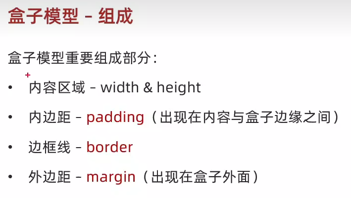
 - 盒子模型被border和padding撑大解决方法
   1. 手动计算，减去border/padding的尺寸
   2. 内减模式:`box-sizing:border-box`
 - margin不会撑大盒子
   - 左右居中:`margin: 上下 auto`
 - 清除标签默认样式
    ```css
     *{
       margin: 0;
       padding: 0;
       /* 盒子内减模式，避免被border和padding撑大 */
       box-sizing: border-box;
       /* 去掉列表的项目符号 */
      list-style: none;
       /* 去掉a标签的下划线 */
       text-decoration: none;
     }
   ```
 - 元素溢出`overflow`
   - hidden 溢出隐藏
   - scroll 溢出滚动（无论是否溢出，都显示滚动调）
   - auto 溢出滚动（溢出才显示滚动调）
 - 塌陷问题
   - 父子级标签，子级添加上外边距，会产生塌陷；导致父子级一起向下移动
   - 解决方法
     1. 取消父级`margin`，父级设置`padding`
     2. 父级设置`overflow:hidden`
     3. 父级设置`border-top`
 - 圆角边框`border-radius`
   - 圆形：`border-radius:50%/高和宽的一半`
   - 胶囊：`border-radius:高的一般`
 - 盒子阴影`box-shadow`
   - X Y 模糊半径 扩散半径 颜色 内外阴影(内inset/默认外)

### 浮动`float`
 - `left`  左对齐
 - `right` 右对齐

#### 清除浮动
   1. 额外标签法：在父元素内容的最后添加一个块级元素`div#clearfix`，设置CSS属性`clear: both`
   2. 单伪元素法：
      ```css
       .clearfix::after {
        /* 伪元素必须要有content属性 */
        content:"";
        display:block;
        clear:both;
       }
      ```
   3. 双伪元素法
      ```css
       /* before 解决外边距塌陷 */
       .clearfix::before,
       .clearfix::after {
        /* 伪元素必须要有content属性 */
       content:"";
       display:table;
       }
       /* after 清除浮动 */
       .clearfix::after {
         clear:both;
       }
      ```
   4. 父级元素添加CSS属性 `overflow:hidden`

### Flex布局`display:flex;`
 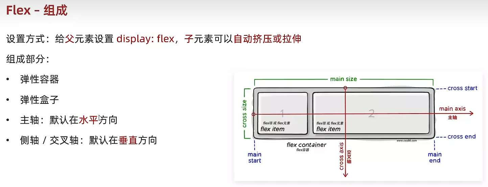
 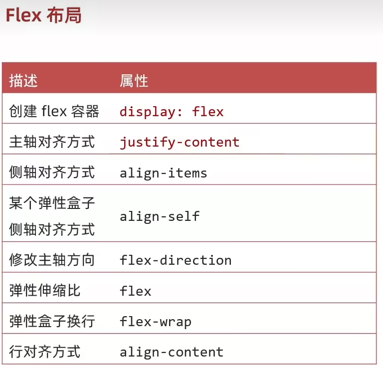
 - 创建Flex容器 `display:flex`
 - 主轴对齐方式 `justify-content`
   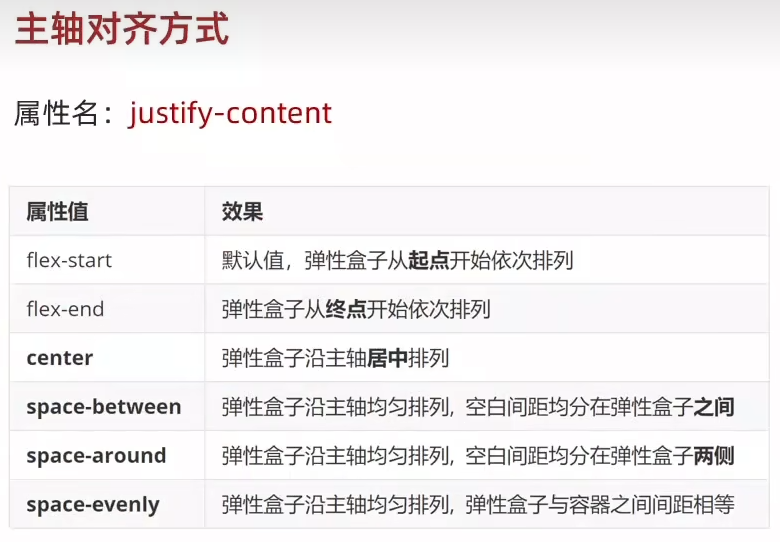
 - 侧轴对齐方式 `align-items`
 - 某个弹性盒子侧轴对齐方式 `align-self`
   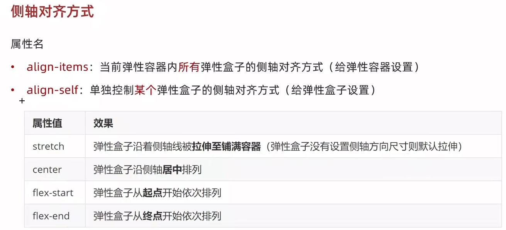
 - 修改主轴方向 `flex-direction`
   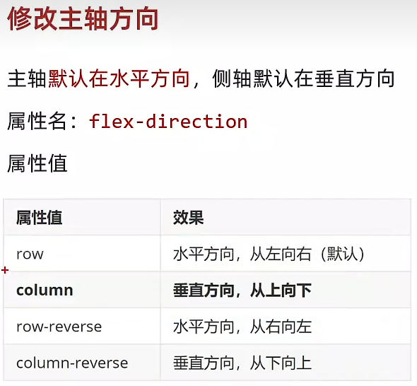
 - 弹性伸缩比 `flex`
   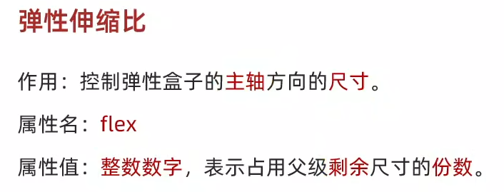
 - 弹性盒子换行 `flex-wrap`
   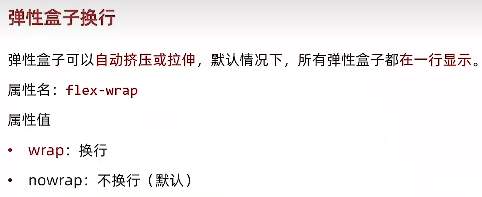
 - 行对齐方式 `align-content`
   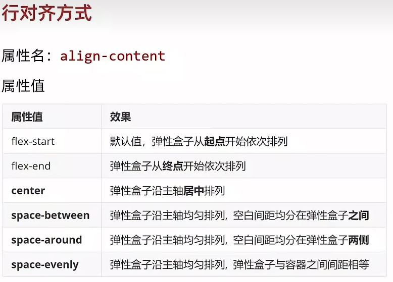

### 定位`position`
 - 子级绝对定位，父级相对定位（子绝父相）
 - `relative` 相对定位
   1. 参照物：自己原来的位置
   2. 不脱标，占位
   3. 标签的显示模式特点不变化
 - `absolute` 绝对定位
   1. 参照物：先找最近的已经定位的祖先元素；如果没有，则以浏览器可视区域改变位置
   2. 脱标，不占位
   3. 显示模式改变：宽高生效（具备行内块的特点）
 - `fixed` 固定定位
   1. 参照物：浏览器窗口
   2. 脱标，不占位
   3. 显示模式改变：宽高生效（具备行内块的特点）
 - `z-index` 堆叠层级
   - 取值是整数，数字越大，越靠上
 - 定位居中
   1. 绝对定位 `position:absolute;`
   2. 水平、垂直边偏移量为50% `left:50%;top:50%;`
   3. 子级向左、上移动自己尺寸的一半 `transform:translate(-50%,-50%);`

  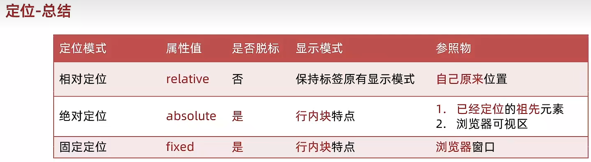

### 字体图标
 - iconfont 图标库: <https://www.iconfont.cn/>
   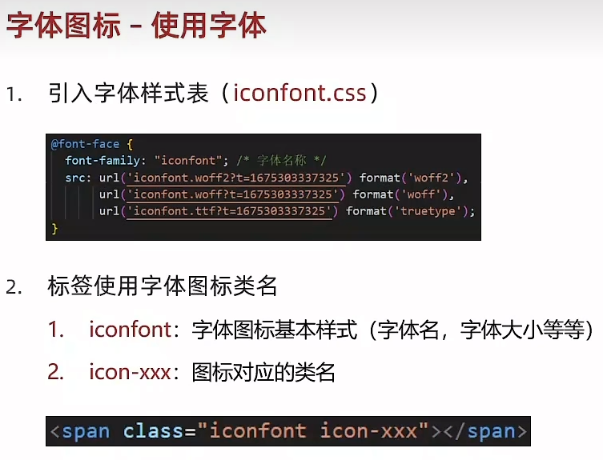
 - 上传矢量图

### 垂直对齐方式 `vertical-align`
 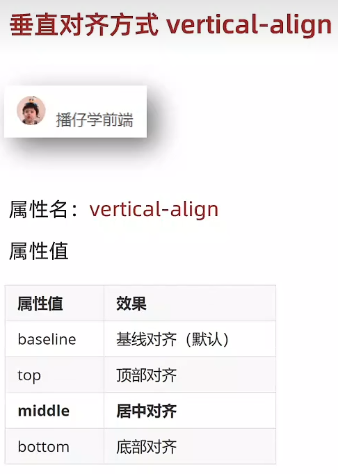
 - `baseline` 基线对齐
 - `top` 顶部对齐
 - `middle` 居中对齐
 - `bottom` 底部对齐

#### 图片底下空白去除方法
 - 因为浏览器把行内块、行内标签当做文字处理，默认按基线对齐
 - 效果:图片img的底下有空白，转块级不按基线对齐，空白就消失了
   1. `display: block;`
   2. 用`vertical-align`

### 透明度 `opacity`
 - 属性值：0-1 ; 设置整个元素的透明度（包含背景和内容）
 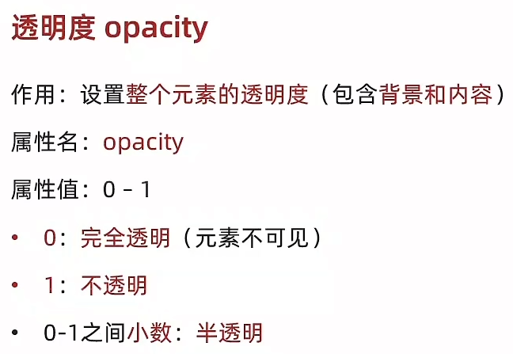

### 光标类型 `cursor`
 - `default` 默认，通常是箭头
 - `pointer` 小手效果，提示用户可以点击
 - `text` 工字型，提示用户可以选择文字
 - `move` 十字光标，提示用户可以移动
 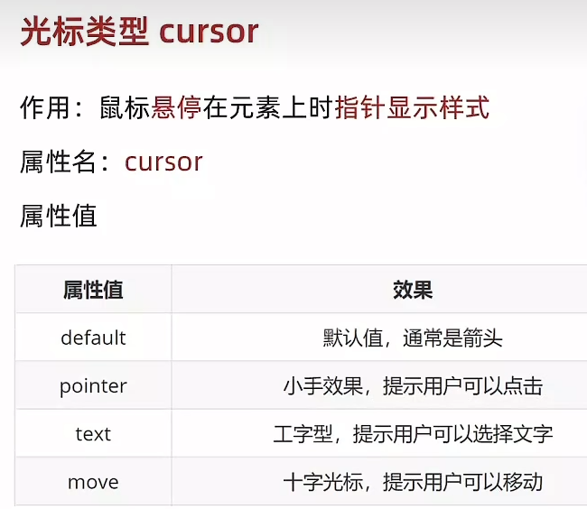

 ### Favicon 图标
  

### 过渡 `transition`
 - 属性值：过渡的属性 花费时间（s）
 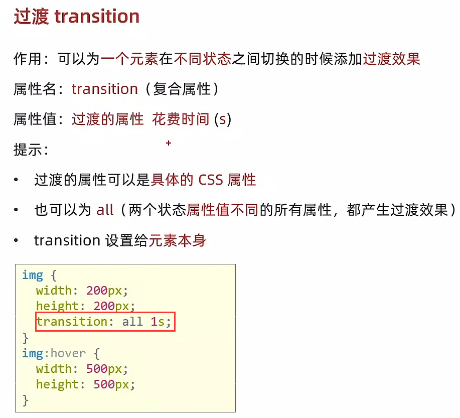

### 平面转换 `transform`
 - 平移 `transform: translate(X轴移动距离,Y轴移动距离)`
 - 旋转 `transform: rotate(旋转角度deg)`
 - 改变转换原点 `transform-origin: 水平原点位置 垂直原点位置`
   - 属性值：left,right,top,bottom,center/像素单位数值/百分比
 - 多重转换（先平移后旋转）`transform: translate(X轴移动距离,Y轴移动距离) rotate(旋转角度deg)`
 - 缩放 `transform: scale(缩放倍数)`/`transform: scale(X轴缩放倍数，Y轴缩放倍数)`
 - 平移实现居中效果
   - 方法1
     ```css
     position:absolute;
     left:50%;
     top:50%;
     /* margin */
     margin-left:宽的一半;
     margin-top:高的一半;
     ```
   - 方法2
     ```css
     position:absolute;
     left:50%;
     top:50%;
     transform:translate(-50%,-50%);
     ```