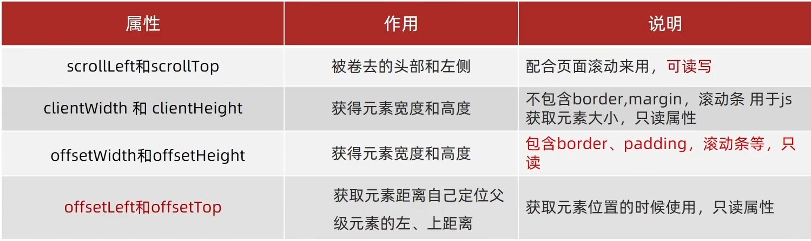

## JavaScript基础
 ### JavaScript组成
  - ECMAScript 规定了JS基础语法核心知识。
  - Web APIs 
    - DOM 操作文档，页面元素的移动、大小、增删改查等
    - BOM 操作浏览器，页面的弹窗、高度检测、存储数据等
 ### 输入输出语法
  - 输出语法
    - `document.write('')` 向body中写内容，可以【写字】；也可以写【标签】
    - `alert('')` 弹出警告对话框
    - `console.log('')` 控制台输出
  - 输入语法
    - `prompt('')`  显示对话框，提示用户输入
 ### 字面量
  - 字面量（literal）是计算机中描述 事/物
  - 1000-数字字面量/'程序员'-字符串字面量/[]-数组字面量/{}-对象字面量...
 ### 变量 `let`
  - 变量就是计算机用来存储数据的容器
  - 变量的初始化：声明（let） + 赋值（=）
 ### 常量 `const`
  - 不允许重新赋值
  - 声明的时候必须初始化
 ### 数组
  - 取值：数组名[下标]
 ### 模板字符串
  - `数字${}个` 外面用反引号包裹，里面 ${变量名}
 ### 数据类型
  - 基本：number数字型|string字符型|boolean布尔型|undefined未定义型|null空类型
  - 引用：Object对象
  - 检测数据类型 `typeof`
    1. 作为运算符：`typeof x`
    2. 函数形式：`typeof(x)`
 ### 数据类型转换
  - 隐式转换：算术运算符都会进行隐式转换
  - 显式转换：
    - 数字型
      1. `Number(数据)`
      2. `parseInt(数据)` 只保留整数
      3. `parseFloat(数据)` 可以保留小数
 ### 运算符
  - 赋值运算符：对变量进行赋值的运算符
    - `+= -= *= /= %=`
  - 一元运算符：自增 自减
    - 自增：`++` 变量值+1
    - 自减：`--` 变量值-1
  - 比较运算符
    - `> < >= <= == === !==`
  - 逻辑运算符
    - `&&` 与 并且 一假全假
    - `||` 或 或者 一真全真
    - `!`  非 取反
 ### 分支语句
  - if-else语句：单分支、双分支、多分支
  - 三元运算符：`条件 ? 满足执行的代码 : 不满住执行的代码`
  - switch语句
    - 当`数据 === 值`才执行对应的语句
    ```JavaScript
    switch(数据) {
      case 值1:
          代码1
          break
      case 值2:
          代码2
          break
      default:
          代码n
          break
    }
    ```
 ### 循环语句
  - while 循环
    - 循环三要素
      1. 变量的起始值
      2. 终止条件
      3. 变量的变化量
      ```JavaScript
      let i = 1
      while(i <= 3) {
        document.write('循环3次')
        i++
      }
      ```
  - 循环退出
    - break：退出循环
    - continue：结束本次循环，继续下次循环
  - for循环
 ### 数组
  - 数组（Array）：是一种可以按顺序保存数据的数据类型
  - 使用：（所以或者下标都是从0开始）
    1. 声明数组 `let arr = [1,2,'A',true]` `let arr = new Array(1,2,'A',true)`
    2. 取值语法 `数组名[下标]`
    3. 遍历数组 
       ```js
       let arr = [1,2,3,4,5,6]
       for (let i = 0 ;i < arr.length; i++) {
        console.log(arr[i]);
       }
       ```
  - 数组的操作
    - 增：`arr.push()`末尾 `arr.unshift()`开头
    - 删：`ar.pop()`末尾 `arr.shift()`开头 `arr.splice(操作的下标，删除的个数)`
    - 改：`数组[下标] = 新值`
    - 查：`数组[下标]`
 ### 函数
  - 函数的声明
    ```js
    function 函数名称 (形参) {
      函数体
    }
    ```
  - 函数的调用
    ```js
    函数的名称(实参)
    ```
  - 函数的返回值
    - `ruturn`可以返回单个数据，多个数据用数组，也可以结束代码
  - 匿名函数和函数表达式
    1. 具名函数的调用可以写在任何位置
    2. 匿名函数必须先声明后调用
        ```js
        // 函数表达式，匿名函数
        let fn = function () {}
        // 具名函数
        function fn () {}
        ```
  - 立即执行函数：避免全局变量的污染
    ```js
    // 多个立即执行函数需要用`;`隔开
    // 写法一
    (function(){})();
    // 写法二
    (function(){}());
    ```
 ### 逻辑中断
  - 逻辑中断`&&` `||`
    1. `&&` 左边为false就短路 前面为真输出后面，前面为假输出前面
    2. `||` 右边为true就短路  前面为真输出前面，前面为假输出后面
        ```js
        function getSum(x,y) {
          // 当形参x，y没有实参传入时，默认则设置为0
          x = x || 0
          y = y || 0
          console.log(x + y)
        }
        getSum(1,2)
        ```
 ### 对象
  - 对象的声明
    1. let 对象名 = {}
    2. let 对象名 = new Object()
  - 对象的使用
    - 属性
    - 方法
      ```js
      let 对象名 = {
        属性名:属性值1,属性值2,'对象名称-A':'名称A',...;
        方法名:函数
      } 
      ```
  - 对象的增删改查
   - 查询`对象名.属性` `对象名['属性名称']`
   - 修改`对象名.属性 = 新值`
   - 增加`对象名.新属性 = 新值`
   - 删除`delete 对象名.属性`（严格模式无法使用）
  - 对象的遍历
   - `for (...in...)`
      ```js
      let obj = {
        uname:'A',
        age:8,
        num:12
      }
      // 遍历对象
      for (let key in obj) {
        // key是属性名，字符串类型带''
        // 取值obj[key]
        console.log(obj[key])
      }
      ```
  - 随机数`Math.random()`
   - 生成N-M之间的随机整数
   - `Math.floor(Math.random() * (M - N + 1)) + N`

## APIs
 ### DOM和BOM
   - DOM（文档对象模型|操作网页内容）、BOM（浏览器对象模型）
 ### DOM
   - DOM（文档对象模型|操作网页内容）
   - DOM树：文档树直观的体现了标签与标签之间的关系
   - DOM对象：浏览器根据html标签生成的js对象
      - document对象：网页所有的内容都在document里面
  #### 获取DOM对象
  - 使用CSS选择器获取DOM元素
     1. `document.querySelector('CSS选择器')` 选择匹配的第一个元素————返回一个对象
     2. `document.querySelectorAll('CSS选择器')` 选择所有的元素—————返回一个对象数组集合
  - 使用其他方法获取DOM元素
     1. `document.getElementById('')` 根据id获取一个元素
     2. `document.getElementByTagName('')` 根据标签获取一类元素
     3. `document.getElementByClassName('')` 根据类名获取一类元素
  #### 操作元素内容
  - 对象.innerText属性
     - 将文本内容添加/更新到任意标签位置
     - 显示纯文本，不解析标签
  - 对象.innerHtml属性
     - 将文本内容添加/更新到任意标签位置
     - 会解析标签，多标签建议使用模板字符
  #### 操作元素的属性
  - 操作元素常用属性
     - 语法：`对象.属性 = 值`
  - 操作元素样式属性
     1. `对象.style.样式属性 = '值'` 通过style属性操作CSS
     2. `对象.className = '类名'` 通过添加类名（className）操作CSS，会覆盖之前标签的类名
     3. 通过classList操作类控制CSS
       - 增加类名 `对象.classList.add('类名')`
       - 删除类名 `对象.classList.remove('类名')`
       - 切换类名 `对象.classList.toggle('类名')`
  - 操作表单元素属性
     - 语法：`DOM对象.属性名 = 值`
     - 只接受布尔值 `对象.checked = true/false`勾选 `对象.disable = true/false`禁用
  - 自定义属性
     - 以`data-自定义名称`命名
     - 获取：`对象.dataset.自定义名称`
  #### 定时器
  1. `setInterval(函数/函数名,间隔时间)` 开启定时器
     - 返回的是一个单独的ID序号
     - 作用：每隔一段时间调用这个函数
     - 间隔时间单位是毫秒
  2. `clearInterval(变量名)` 关闭定时器
     ```js
     //返回的是一个单独的ID序号
     let 变量名 = setInterval(函数,间隔时间)
     // 停止定时器
     clearInterval(变量名)
     // 重新开启定时器
     变量名 = setInterval(函数,间隔时间)
     ```
  #### 事件监听
  - 事件：用户在页面触发的行为
  - 事件监听：给元素添加事件，当事件触发时执行相应的代码
    - 事件监听三要素：
      - 事件源：触发事件的元素
      - 事件类型：触发事件的行为
      - 事件处理程序：触发事件后要执行的代码（函数）
    - 语法：`对象.addEventListener('事件名',函数,是否捕获)`
      - 事件名：on开头的事件，如onclick
      - 函数：事件触发时执行的函数
      - 是否捕获：布尔值，默认是false，不捕获
    - 移除事件监听：`对象.removeEventListener('事件名',函数,是否捕获)`
  - 事件类型
    - 鼠标事件
      - `click` 鼠标点击
      - `mouseenter` 鼠标进入
      - `mouseleave` 鼠标离开
    - 键盘事件
      - `keydown` 键盘按下
      - `keyup` 键盘抬起
    - 表单事件
      - `focus` 获得焦点
      - `blur` 失去焦点
      - `change` 失去焦点时触发
      - `input` 内容改变时触发
    - 页面事件
      - `load` 页面加载完成
      - `unload` 页面关闭
      - `resize` 窗口大小改变
      - `scroll` 滚动条滚动
  - 事件对象
    - 事件对象是事件发生时，系统自动创建的一个对象，包含了事件相关的信息
    - 在事件绑定的函数中，默认有一个事件对象`event/e/ev`
       ```js
       // 获取事件对象
       元素.addEventListener('事件名',function(event){
           console.log(event)
       })
       ```
    - 事件对象中的常用属性
       - `event.target` 返回触发事件的元素
       - `event.type` 返回事件类型
       - `event.clientX` 返回鼠标指针的水平坐标（相当于浏览器可视窗口）
       - `event.clientY` 返回鼠标指针的垂直坐标（相当于浏览器可视窗口）
       - `event.key` 返回键盘键的字符
       - `event.offsetX` 返回鼠标指针的水平坐标（相当于事件源元素）
       - `event.offsetY` 返回鼠标指针的垂直坐标（相当于事件源元素）
  - 环境对象
    - 环境对象是事件发生时，系统自动创建的一个对象，包含了事件相关的信息
    - 在事件绑定的函数中，默认有一个环境对象`this`
       ```js
       // 获取环境对象
       元素.addEventListener('事件名',function(event){
           console.log(this)
       })
       ```
  - 回调函数
    - 函数A作为参数传递给函数B时，我们称函数A为回调函数
    - 回调函数是事件发生时，系统自动调用的函数
    - 回调函数的参数
       - `event` 事件对象
       - `this` 环境对象
    - 回调函数的返回值
       - 返回值会作为事件处理函数的返回值
  - 事件流
    - 事件流描述的是从页面中接收事件的顺序
    - 事件流分为三个阶段
       - 事件捕获阶段
         - 从`document`开始，依次向下传播到目标元素
       - 处于目标阶段
         - 事件到达目标元素，触发目标元素的响应函数
       - 事件冒泡阶段
         - 从目标元素开始，依次向上传播到`document`
    - 阻止冒泡和捕获
       - `事件对象[event/e/ev].stopPropagation()` 阻止冒泡
    - 事件解绑
       - L0事件解绑
         - `元素.onclick = null`
       - L2事件解绑
         - `元素.removeEventListener('事件名',回调函数)`
  - 事件委托
    - 事件委托的原理
       - 不是每个子节点单独设置事件监听器，而是事件监听器`设置在其父节点`上，然后利用冒泡原理影响设置每个子节点
    - 事件委托的优点
       - 省去了为每个子节点添加事件监听器的工作
       - `事件对象[event/e/ev].target`来获取触发事件的全部子节点对象
       - `事件对象[event/e/ev].target.tagName`来获取触发事件的对应的子节点对象
  - 阻止默认行为
    - `event对象[event/e/ev].preventDefault()`
    - `return false`
  - 其他事件
    1. 页面加载事件
      - `DOMContentLoaded` 页面加载完成，不包括样式表、图片、flash等（给document添加）
      - `load` 页面加载完成，包括样式表、图片、flash等（给window添加）
    2. 元素滚动事件
      - `scroll` 元素滚动条滚动
        - 监听整个页面滚动
          - 获取Html元素写法 `document.documentElement`
          ```js
          window.addEventListener('scroll',function(){
              console.log('滚动了')
          })
          ```
        - 监听某个元素滚动
          - `scrollLeft` 元素水平滚动条的位置
          - `scrollTop` 元素垂直滚动条的位置
          ```js
          元素.addEventListener('scroll',function(){
              console.log('滚动了')
          })
          ```
    3. 页面尺寸事件
      - `resize` 窗口大小改变
        ```js
        // 监听整个页面尺寸改变
        window.addEventListener('resize',function(){
            console.log('窗口大小改变了')
        })
        // 监听某个元素尺寸改变
        元素.addEventListener('resize',function(){
            console.log('窗口大小改变了')
        })
        ```
      - 获取元素宽高（不包含边框、margin、滚动条等）
        - `clientWidth` 元素可视区的宽度
        - `clientHeight` 元素可视区的高度 
      - 获取元素宽高（包含边框、margin、滚动条等）
        - `offsetWidth` 元素可视区的宽度
        - `offsetHeight` 元素可视区的高度
  - 元素尺寸与位置
    1. 获取元素宽高（包含边框、margin、滚动条等）
       - `offsetWidth` 元素可视区的宽度
       - `offsetHeight` 元素可视区的高度
    2. 获取元素位置
       - `offsetLeft` 元素相对于其定位父元素的水平偏移量
       - `offsetTop` 元素相对于其定位
       - `element.getBoundingClientRect()` 返回元素的大小及其相对于视口的位置
    
  #### 日期对象
  - 实例化（new）
    - `const date = new Date()`获取当前时间
    - `const date = new Date('2020-11-25 12:0:0')`获取指定时间
  - 日期对象的方法
    - `getFullYear()` 获取当前日期的年份
    - `getMonth()` 获取当前日期的月份（0-11）
    - `getDate()` 获取当前日期的天数（1-31）
    - `getDay()` 获取当前日期的星期几（0-6）
    - `getHours()` 获取当前日期的时
    - `getMinutes()` 获取当前日期的分
    - `getSeconds()` 获取当前日期的秒
    - `getMilliseconds()` 获取当前日期的毫秒
    - `toLocalString()` 获取当前日期的本地字符串表示
    - `toLocaleDateString()` 获取当前日期的本地日期字符串表示
    - `toLocaleTimeString()` 获取当前日期的本地时间字符串表示
  - 时间戳
    - 解释：时间戳是指从1970年1月1日00:00:00 UTC到当前时间所经过的毫秒数
    - 方法1 `getTime()`
      ```js
      const date = new Date()
      // 当前时间戳
      const timestemp =  date.getTime()
      // 指定时间戳
      const timestemp =  new Date('2020-11-25 12:0:0').getTime()
      ```
    - 方法2 `Date.now()`
      ```js
      // 当前时间戳
      const timestemp = Date.now()
      ```
    - 方法3 `+new Date()`
      ```js
      // 当前时间戳
      const timestemp = +new Date()
      // 指定时间戳
      const timestemp =  +new Date('2020-11-25 12:0:0')
      ```
